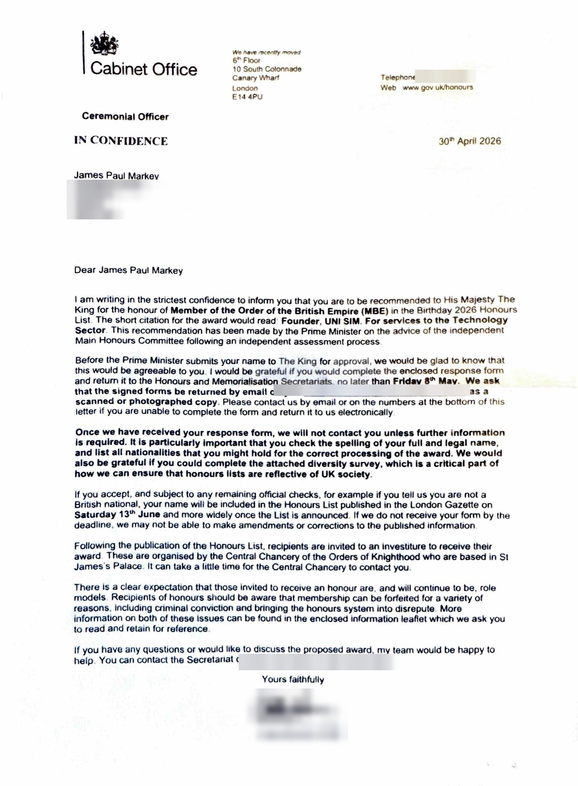

Yesterday I learned that I have been appointed a **Member of the Order of the British Empire (MBE)** in His Majesty The King's Birthday Honours 2026. I am still struggling to find the words, but the first one has to be: **thank you.**

This is an honour I never expected and could never have achieved alone. It belongs just as much to my family, my friends, my colleagues and everyone who has believed in the work along the way — at [UNI SIM](https://unisim.co.uk), at [Virteasy Dental](https://www.virteasy.com), across the dental and medical education community, and beyond. To be recognised in this way is humbling beyond measure.

The full list is published by the Crown in [The Gazette](https://www.thegazette.co.uk/all-notices/content/104460) and on [GOV.UK](https://www.gov.uk/government/publications/the-kings-birthday-honours-list-2026). To see my name alongside so many extraordinary people who give so much to this country is something I will never take for granted.

What moves me most is learning that the recommendation for this honour came from the Prime Minister himself. I have been fortunate enough to meet him on a number of occasions — travelling with him to India as part of the trade delegation, serving on the committee for the Make Work Pay Act, and joining him at No 10 Downing Street for a celebration evening. Each of those moments was a privilege in its own right, and one I will always treasure, but I never for a single moment imagined anything like this. To have his personal backing for this recognition leaves me truly humbled.

Receiving the official letter still feels surreal:

An honour like this is not a finish line — it is a responsibility. I want to be clear about how I intend to carry it: I will do everything I can to be a stand-up citizen, to keep doing my best in everything I take on, and to give back wherever and however I can. Whether that is advancing the state of dental and medical education, supporting people living with bipolar disorder through [Bipolar Bear](https://bipolarbear.app), championing British innovation abroad, or simply showing up for the people around me — I will try every single day to live up to the trust this honour represents.

To His Majesty The King, to those who took the time to nominate and support me, and to everyone who has walked even a small part of this journey with me — thank you, from the bottom of my heart. I will not let you down.
