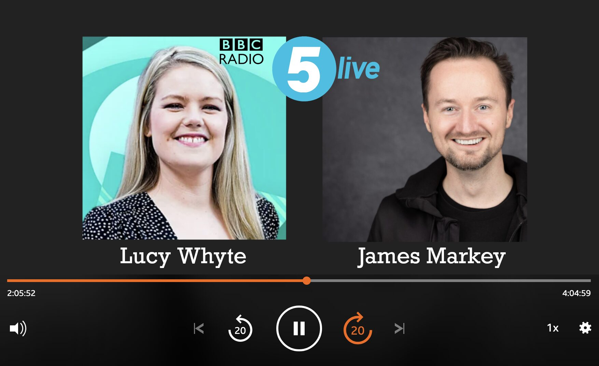

import ProseFigure from "~/components/ProseFigure.astro";

James Markey on BBC Radio Five Live: Summer, Bipolar, and Support

We’re thrilled to announce that James Markey, who openly lives with bipolar type two, was interviewed today on BBC Radio Five Live! The insightful discussion, hosted by Lucy Whyte, delved into a crucial topic: how the summer months can affect the management of bipolar disorder.

James shared his personal experiences and valuable insights, shedding light on the unique challenges and strategies involved in navigating bipolar during the warmer seasons. The conversation highlighted the often-overlooked impact of seasonal changes on mental health, particularly for those with bipolar.

A key takeaway from the interview was the vital role of support organizations. The discussion emphasized that Bipolar UK is an invaluable resource, offering guidance, community, and support for individuals living with bipolar and their families. Their work is crucial in helping people understand and manage their condition effectively, regardless of the time of year.

We’re incredibly proud of James for his courage and willingness to share his story on such a prominent platform. His openness helps to reduce stigma and raises essential awareness about bipolar disorder. If you missed the interview, you can listen back at the following link: https://www.bbc.co.uk/sounds/play/m002g178.

Images can be used freely in all cases:

