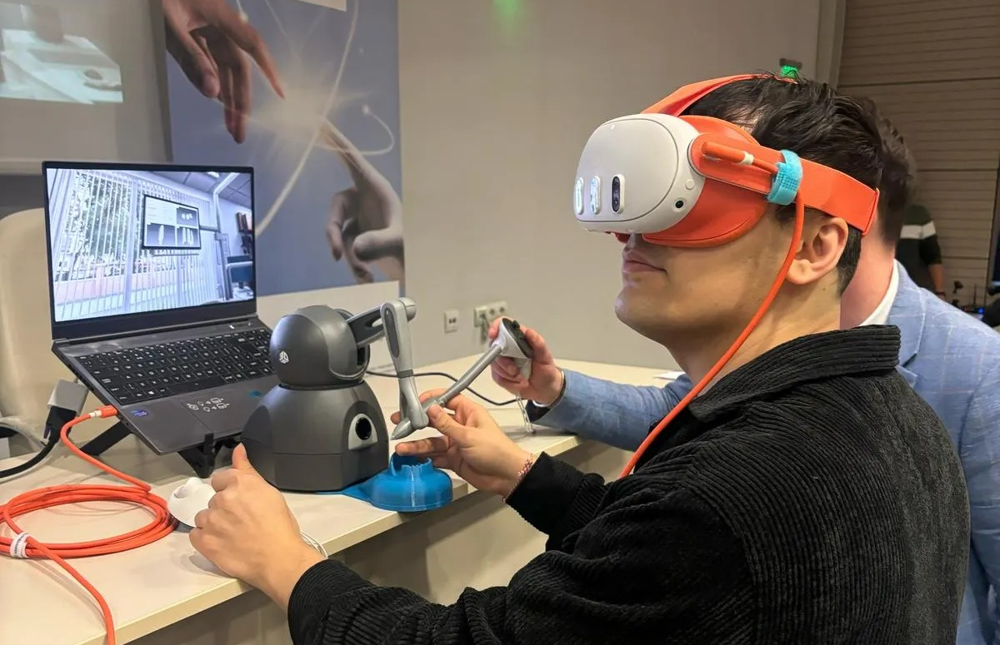
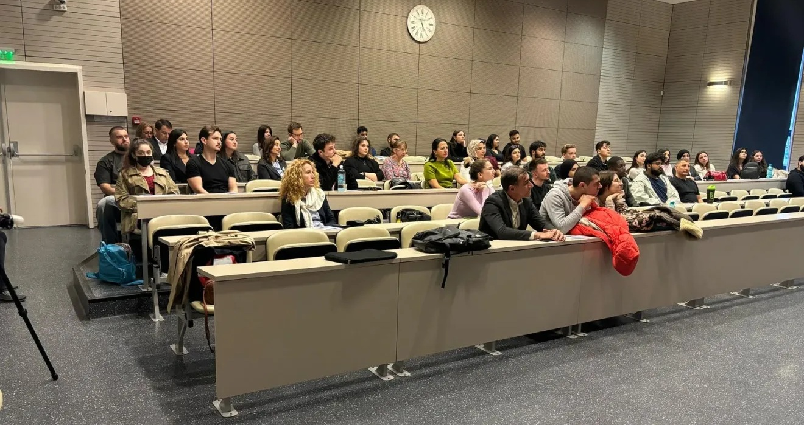

import ProseFigure from "~/components/ProseFigure.astro";

**Cutting-Edge Dental Simulation Takes the Stage at Plovdiv University**

Plovdiv University recently hosted a special event highlighting the future of dental education, featuring a live demonstration and seminar by **James Markey** of **UNI SIM** and **Virteasy Dental**. The event was held in collaboration with **Professor Dr. Jorge Domínguez** from **ADEMA University** in Palma, Mallorca, and was organized through the generous invitation of **Prof. Neshka Manchorova** from the Faculty of Dental Medicine.

James Markey introduced attendees to the advanced capabilities of **Virteasy Dental**, a state-of-the-art virtual reality system that allows dental students to practice procedures in an immersive and highly realistic environment. The interactive demonstration gave students and faculty the chance to explore the simulator firsthand and understand its potential to transform clinical training.

Professor Domínguez contributed valuable academic insights, sharing experiences from ADEMA University where simulation-based training has already been successfully integrated into the dental curriculum. His presentation emphasized how such technology supports **more effective, hands-on learning** and better prepares students for real-world clinical situations.

The seminar was well-received by students, educators, and professionals alike, sparking conversations about innovation, collaboration, and the evolution of dental education in Bulgaria. This visit represents an exciting step forward in bringing **cutting-edge simulation tools** to universities across Europe and fostering global partnerships in healthcare education.

