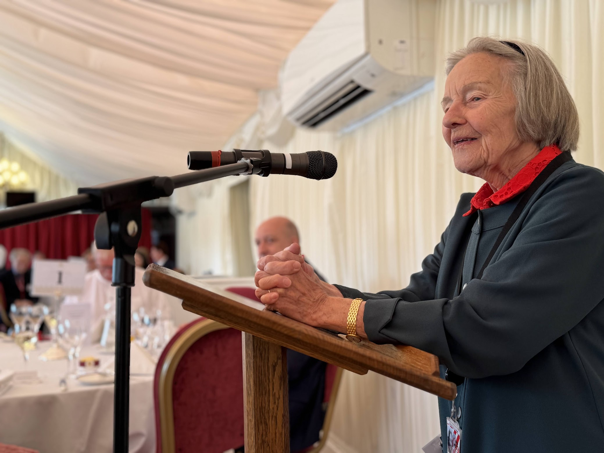

import ProseFigure from "~/components/ProseFigure.astro";

It’s been a busy and prestigious time for James Markey, the dynamic founder of UNI SIM. Recently, he received a distinguished invitation to the annual luncheon of the National Conference of University Professors (NCUP) at the iconic House of Lords.

This event is a significant highlight in the academic calendar, bringing together leading figures from across the UK’s university system to discuss critical issues in higher education. For James, whose company, UNI SIM, is revolutionising medical and dental training with haptic and VR technologies, attending such a gathering at the heart of British governance is a powerful testament to the impact his work is having.

Being invited to the House of Lords for the NCUP lunch underscores the growing recognition of how innovative companies like UNI SIM are shaping the future of education and professional development. It’s an opportunity for James to engage directly with influential academics and policymakers, showcasing how his Guildford-based firm is contributing to a more skilled and prepared generation of medical professionals.

This kind of high-level engagement is crucial for UNI SIM’s mission to make cutting-edge simulation training widely accessible. It’s a clear signal that the vital role of technology in enhancing practical learning is being acknowledged at the highest levels, further solidifying James Markey’s position as a key innovator in the UK’s educational landscape. What a fantastic opportunity to connect with the very people driving the future of academia!

