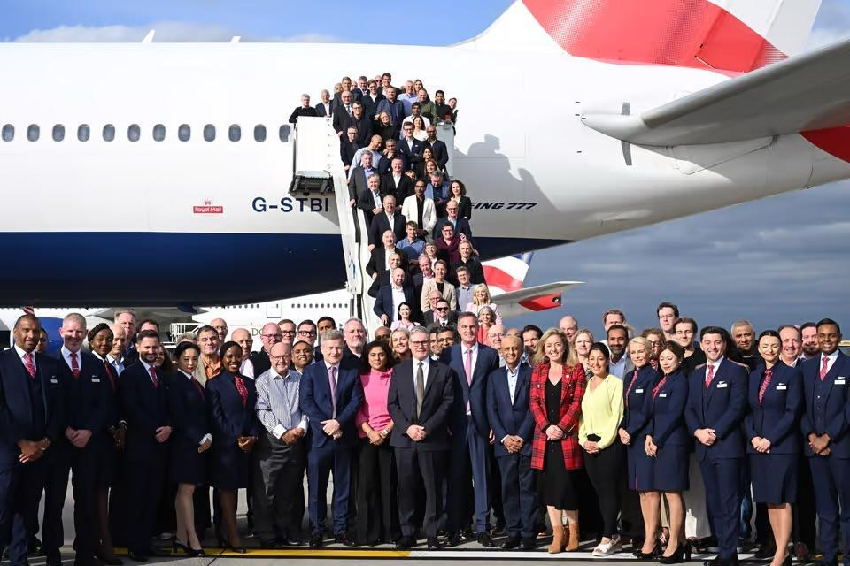
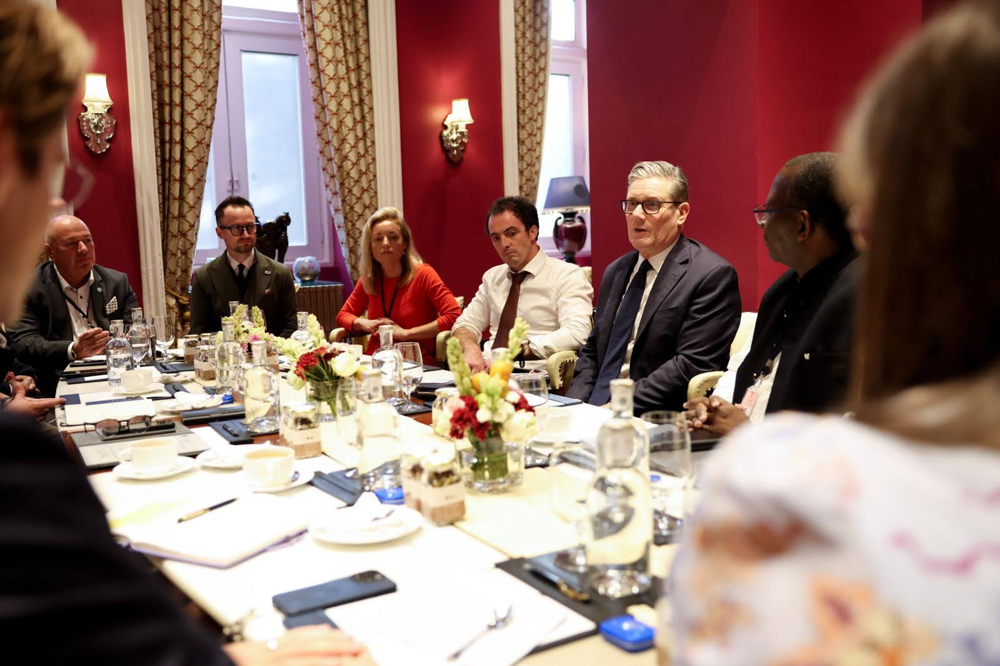
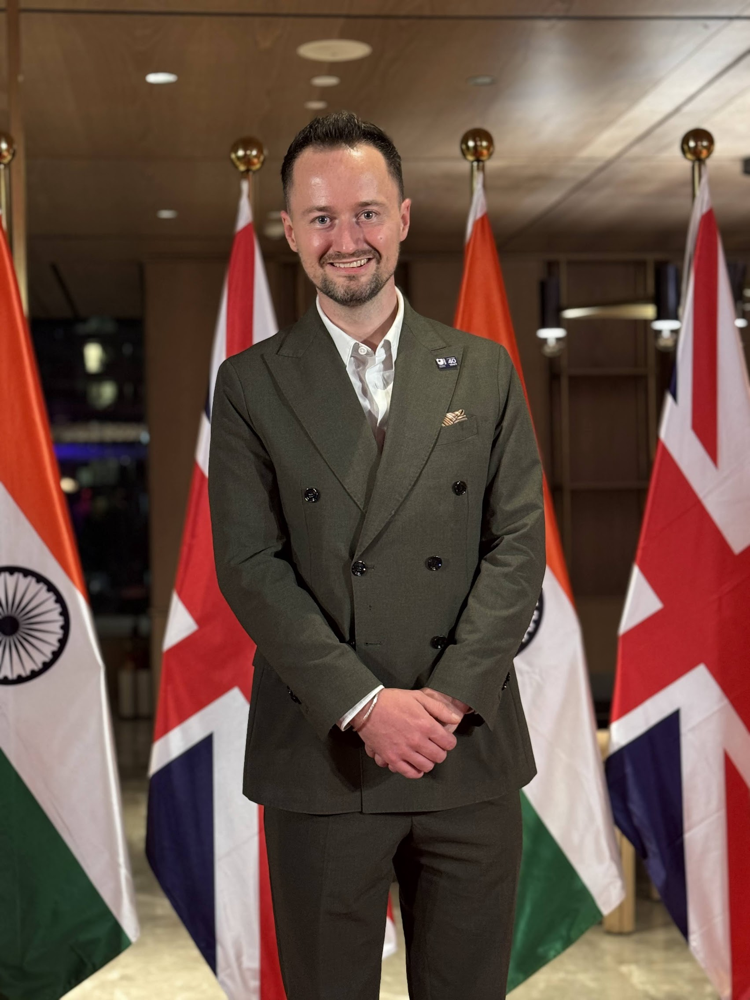
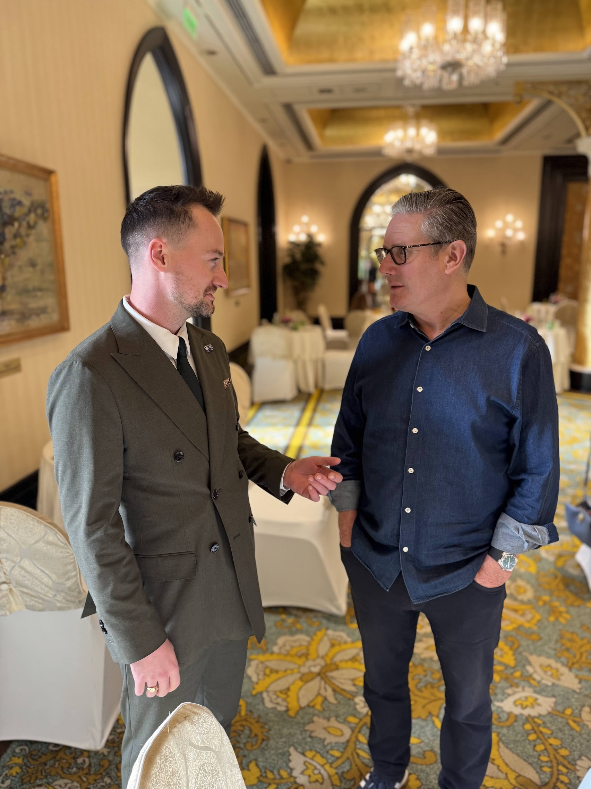
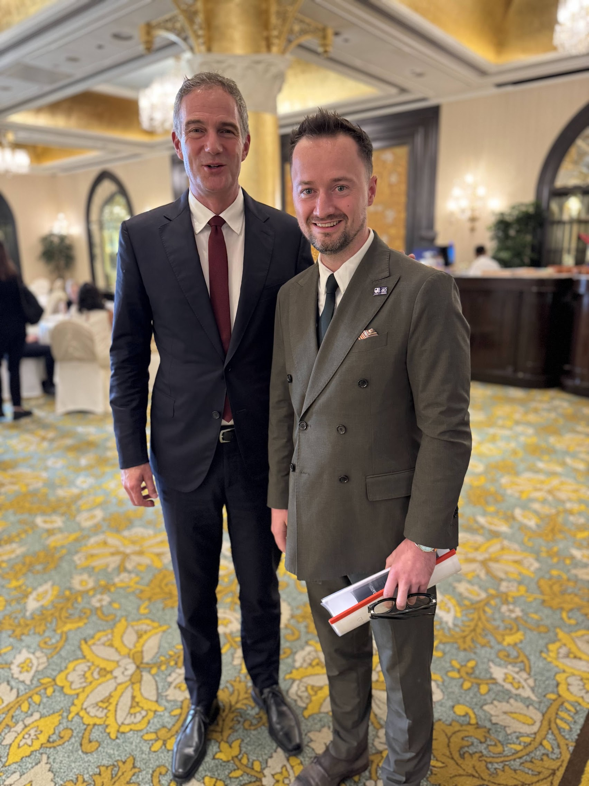
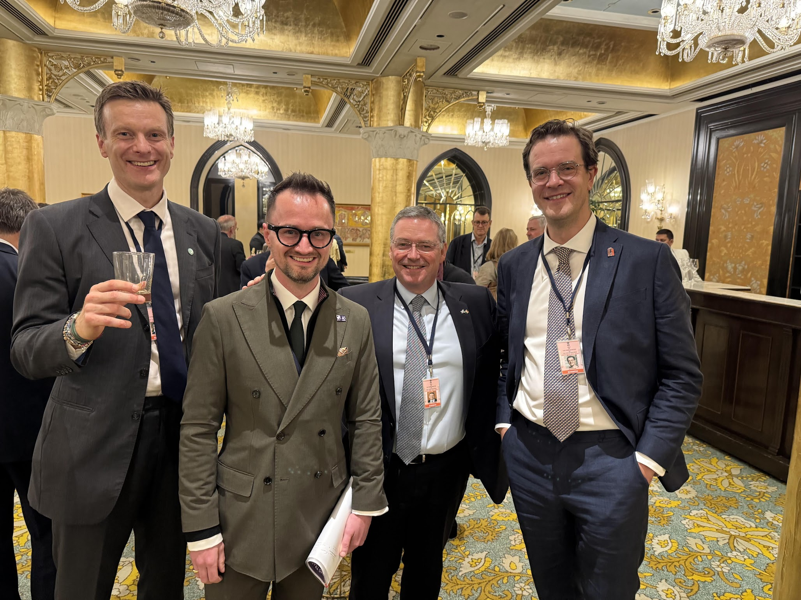

import ProseFigure from "~/components/ProseFigure.astro";

Last week I had the extraordinary privilege of traveling to India alongside Prime Minister Keir Starmer as part of the UK’s historic trade delegation. Representing the vibrant community of small businesses that export worldwide—and standing proudly as the founder of **Universal Simulation Ltd (unisim.co.uk)**—the experience was both inspiring and deeply affirming.

* * *

### A Momentous Visit

Prime Minister Starmer’s two‑day trip to Mumbai marked the largest UK business delegation ever sent to India, featuring over 100 CEOs, entrepreneurs, university leaders and cultural figures. The purpose was clear: to build on the landmark UK‑India trade pact signed earlier this year and to unlock fresh opportunities for Britain’s 5.6 million small enterprises.

Walking into the bustling corridors of the Taj Mahal Hotel, I felt the weight of history and the promise of future collaborations. The delegation’s agenda was packed—high‑level meetings with Prime Minister Narendra Modi, round‑tables with Indian industry leaders, and site visits to cutting‑edge tech hubs. Yet amid the grandeur, what resonated most were the intimate conversations with fellow small‑business owners, each eager to turn the trade deal into tangible growth.

* * *

### Why Small‑Business Export Matters

Small firms are the engine of the UK economy, accounting for a significant share of jobs and innovation. Yet many face barriers when trying to reach overseas markets—limited resources, regulatory complexities, and a lack of local networks. The UK‑India partnership offers a unique gateway:

-   **Reduced tariffs and streamlined customs** under the new agreement lower cost‑of‑entry for UK products.
-   **Joint innovation programmes** foster co‑development of technology, especially in sectors like clean energy, fintech and advanced manufacturing.
-   **The “Great British Pitch”** initiative, slated for November, will give SMEs a platform to showcase solutions directly to Indian investors and buyers.

Being part of this delegation allowed me to voice these needs directly to policymakers and to hear first‑hand how India’s rapidly expanding consumer base is hungry for innovative, high‑quality UK offerings.

* * *

### Personal Reflections

-   **Gratitude:** Sharing the stage with Prime Minister Starmer and meeting Indian leaders was a humbling reminder of how far small‑business advocacy has come.
-   **Connection:** The genuine curiosity from Indian entrepreneurs about our simulation solutions sparked ideas for joint pilots that could launch later this year.
-   **Momentum:** The energy of the delegation convinced me that the UK‑India trade deal isn’t just a diplomatic milestone—it’s a catalyst for real‑world growth for companies like ours.

* * *

