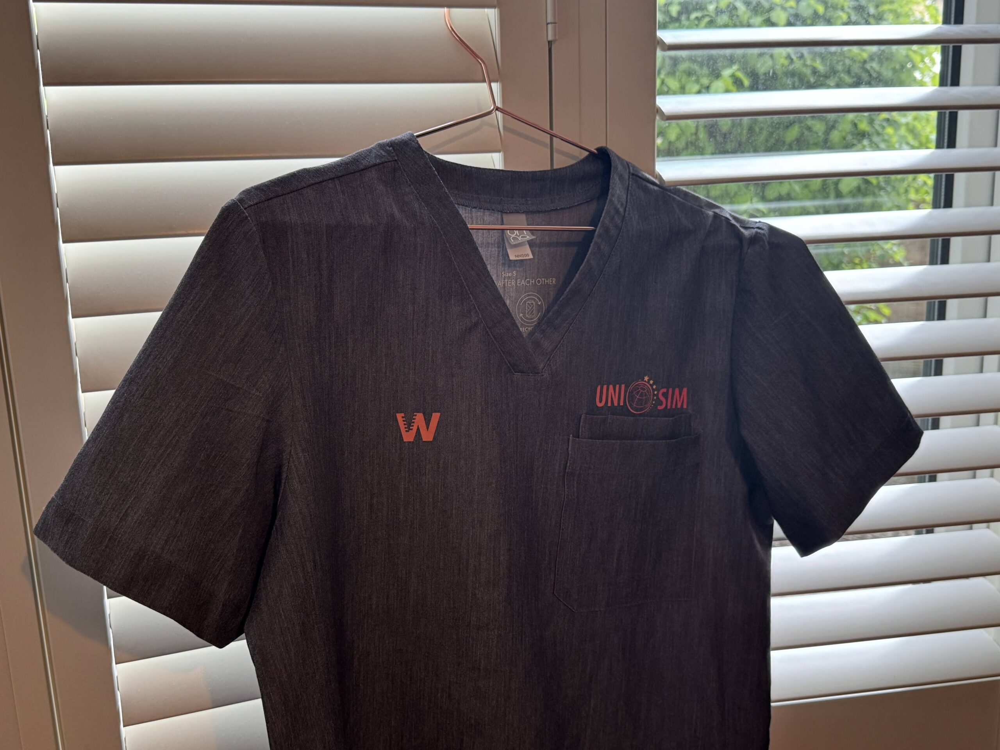

import ProseFigure from "~/components/ProseFigure.astro";

I am very proud to have been recognised recently by both:

-   Being presented with a pair of honorary dental scrubs at the British Dental Association show in Birmingham for advancing the state of dental education in the UK
-   Being invited to the House of Lords for the annual lucheon of the National College of University Professors

Thank you so much to those involved.

The work we do at [UNI SIM](https://www.unisim.co.uk) and at [Virteasy Dental](https://www.virteasy.com) is having a real, and profound, impact on education around the world and we hope to continue to contribute positively towards the goal of improving education for everyone.

Below if the [original article](https://unisim.co.uk/james-markey-honoured-for-revolutionising-uk-dental-education/):

 

The landscape of dental education here in the UK is undergoing a remarkable transformation, thanks in no small part to the visionary work of **James Markey**. As the founder and CEO of **UNI SIM** in the UK and Sales for **Virteasy Dental** in France, James has been at the forefront of integrating ground-breaking **haptic** (sense of touch) and **VR** (immersive experience) technologies into dental curricula across the nation and abroad. His pioneering efforts haven’t just pushed the boundaries of what’s possible in dental training, but have also garnered significant recognition, culminating in a series of prestigious honours.

Markey’s impact is perhaps most notably seen at institutions like **the NHS site in Altrincham** and **The University of Newcastle**, where students are now experiencing a new era of hands-on, yet risk-free, learning. Imagine aspiring dentists being able to “feel” the intricate nuances of a dental procedure, performing complex manoeuvres in a virtual environment that mirrors reality – all before ever touching a real patient. This is the power of the haptic and VR integration championed by James, offering unparalleled opportunities for skill development, error correction, and confidence building.

To commemorate his extraordinary contributions, James Markey was recently presented with a unique symbol of appreciation: a pair of **honorary dental scrubs**. This special presentation took place at a **British Dental Association** event in Birmingham, a fitting tribute to someone who is literally reshaping the future of dentistry. The scrubs signify not only his deep connection to the dental profession but also the lasting “hands-on” impact he is having on its educational foundations.

The recognition didn’t stop there. James was also extended an invitation to the esteemed **House of Lords** in London, where he attended the **NCUP conference**. This invitation to such a hallowed institution underscores the national significance of his work and the growing awareness of how technological innovation can elevate professional training.

Notably, James Markey is an alumnus of **The Open University**, holding both a degree and a master’s. The Open University, in a successful partnership with **Santander Universities UK**, played a crucial role in the launch of UNI SIM, demonstrating the power of academic support and entrepreneurial funding in bringing transformative ideas to fruition. Furthermore, James’s expertise and commitment to promoting British innovation on the global stage have been formally recognised, as **he serves as an Export Champion for the Department of Business and Trade.**

**James Markey’s journey is a testament to the power of innovation driven by a clear purpose: to advance the state of dental education.** By bringing the “sense of touch” into the virtual realm, he isn’t just teaching dentistry; he is fundamentally redefining how future dental professionals are trained. His unwavering commitment to integrating cutting-edge technology ensures that UK dental graduates are not only exceptionally skilled but also prepared for the evolving demands of modern dental practice.

The dental community, both here in the UK and beyond, can look to James Markey as an inspiring example of how embracing technological advancements can lead to profound and lasting positive change. Congratulations to James on these well-deserved honours – they are a true reflection of his real impact on the virtual world of dental education.
