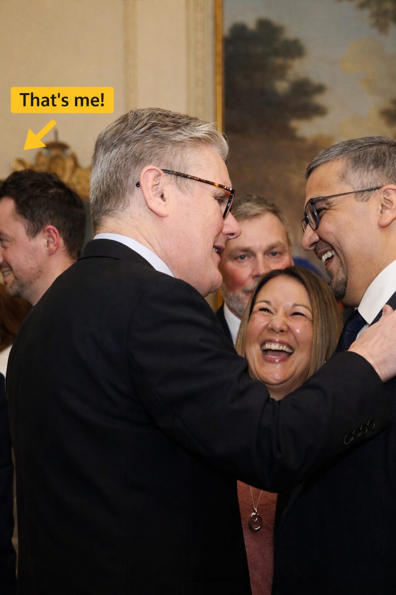
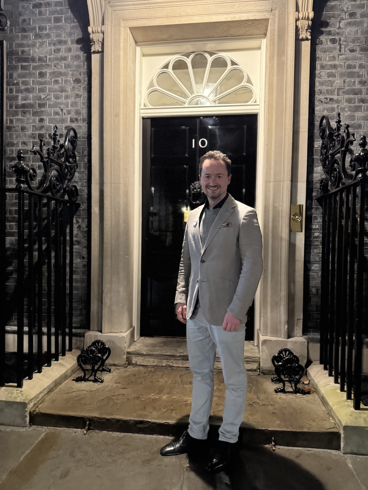

import ProseFigure from "~/components/ProseFigure.astro";

**Getting invited to 10 Downing Street**

It’s a rare privlege because, as a naive citizen, I tried to visit No 10 before only to find out it’s off limits to the general public. The whole street is cordoned off and security is pretty heavy. There’s no pretending to be a lost tourist and slipping through here.

My invite was totally unexpected. I do volunteer at the Department for Business and Trade and I had the good fortune of participating in the (long) process of bringing the Make Work Pay Act to fruition. I played a very, very, small part. So, I was delighted to receive an email inviting me along to a small reception to mark the occassion. The invite didn’t have any more details than the date and the time and the purpose.

**When to turn up to Number 10 Downing Street**

My invited was for 6.45pm and, of course, I turned up early. Too early in fact, because there was a reception before the reception so I had to go find a Pret and get a tea. The best time to arrive is about 30 minutes before, and even then you might be waiting before the official queue starts.

**What to wear to No 10 Downing Street**

Lets be honest, everyone is pretty smartly dressed. Most men are in shirts, ties (not me) and navy jackets (I had a grey one) but, to be honest, chanches are you are invited here on merit so I wouldn’t worry if you want to spice things up a bit and, nowadays, you could dress down (a bit) too.

**Inside No 10 Downing Street**

Once you’re through the first gates you are poushed along through a mini airport-like security. When finally takes you to Downing Street. It’s eery because you find yourself on a street and you’re not too sure where to go but you assume you keep on walking – you do. As luck would have it Larry the Cat decides to cross the road. Once you reach the famous door you reach for the knocker to someone immediately opening the door.

In here you have a small reception area where you get checked in again. You leave your phone in a small cubby hole which, surprisingly, is not particuarly secure but you hope nothing with go awry. Next along is a coat area (I believe it’s a meeting room normally), where you get a number for your jacket. You keep going until the reach a lobby and then swing a right.

Now – you’re in Love Actually and you see the famous staircase decorated with the photos of all the ex Prime Ministers. Top of the stairs and you’re at the reception room to network in wait for the VIPs. In this case we had; Keir Starmer, Angela Rayner, Peter Kyle and Bridget Phillipson to keep us entertained.

**When to leave 10 Downing Street**

Once the speeches are over, the VIPs will stay and mingle around the room and the comms team are ready to snap a few nice shots. After a little while, the VIPs will leave and now is probably the best time to leave whilst everyone finishes up drinks and clear the canape plates.

Part of the reason for this is that you get to take all your photos on the way out at the famous door, so it’s best to beat the crowd.

A few minutes later you would leave through the visitor exit and be the normal person you were just an hour and a half ago.
